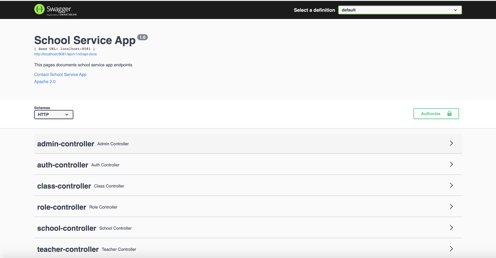

# School Service Application
This application helps manage school operations

## Functionalities
- `An admin can add a teacher to a school`
- `An admin can remove a teacher from a school`
- `A teacher can add a student to a class`
- `A teacher can remove a student from a class`
- `A teacher, student or admin can choose to update his/her credentials`

## Requirements
- JAVA 11
- Spring Boot
- Docker

## Getting Started
1. If not already done, [install Docker Compose](https://docs.docker.com/compose/install/)
2. Navigate to your project root folder
3. Run `./gradlew build`
4. Run `docker compose build --pull --no-cache` to build fresh images
5. Run `docker compose up` to startup application (the logs will be displayed in the current shell)
6. Your app default port is 8081, you can change this in the docker compose file
7. On successful startup, your app `BASE_URL` is http://localhost:8081
8. Run `docker compose down --remove-orphans` to stop the application (Docker containers).

## Guide
- Api documentation are provided - see http://localhost:8081/api/v1/swagger-ui/index.html

## Note
- On application startup, a default super admin user is created
- Super Admin Username `johndoe`
- Super Admin Password `password`

## User Flow
### !!!IMPORTANT!!!
- To get all roles, see `http://localhost:8081/api/v1/swagger-ui/index.html#/role-controller/allUsingGET`
- To get all schools, see `http://localhost:8081/api/v1/swagger-ui/index.html#/school-controller/allUsingGET_1`
- To get all your school classes, see `http://localhost:8081/api/v1/swagger-ui/index.html#/class-controller/allSchoolClassesUsingGET`

### SUPER ADMIN
- On application startup, a default super admin is created
- Super Admin Username `johndoe`
- Super Admin Password `password`
- Super Admin can make a user an admin,  see `http://localhost:8081/api/v1/swagger-ui/index.html#/admin-controller/assignAdminRoleToUserUsingPATCH`

### ADMIN
- Register as a user, see `http://localhost:8081/api/v1/swagger-ui/index.html#/auth-controller/registerUsingPOST`
- A Super admin (authenticate as a super admin) then makes newly registered user and admin, see `http://localhost:8081/api/v1/swagger-ui/index.html#/admin-controller/assignAdminRoleToUserUsingPATCH`
- An admin can add a teacher to a school see `http://localhost:8081/api/v1/swagger-ui/index.html#/admin-controller/addTeacherToSchoolUsingPATCH`
- An admin can remove a teacher from a school see `http://localhost:8081/api/v1/swagger-ui/index.html#/admin-controller/removeTeacherFromSchoolUsingPATCH`
- An admin can choose to update his/her credentials,  see `http://localhost:8081/api/v1/swagger-ui/index.html#/auth-controller/updateCredentialsUsingPATCH`

### TEACHER
- Register as a user, see `http://localhost:8081/api/v1/swagger-ui/index.html#/auth-controller/registerUsingPOST`
- An admin (authenticate as an admin) then make newly registered user a teacher, see `http://localhost:8081/api/v1/swagger-ui/index.html#/admin-controller/assignAdminRoleToUserUsingPATCH`
- A teacher can add a student to a class see `http://localhost:8081/api/v1/swagger-ui/index.html#/teacher-controller/addStudentToClassUsingPATCH`
- A teacher can remove a student from a class see `http://localhost:8081/api/v1/swagger-ui/index.html#/teacher-controller/removeStudentFromClassUsingPATCH`
- A teacher can choose to update his/her credentials,  see `http://localhost:8081/api/v1/swagger-ui/index.html#/auth-controller/updateCredentialsUsingPATCH`

### STUDENT
- Register as a user, see `http://localhost:8081/api/v1/swagger-ui/index.html#/auth-controller/registerUsingPOST`
- An admin (authenticate as an admin) then make newly registered user a student, see `http://localhost:8081/api/v1/swagger-ui/index.html#/admin-controller/assignAdminRoleToUserUsingPATCH`
- A teacher can choose to update his/her credentials,  see `http://localhost:8081/api/v1/swagger-ui/index.html#/auth-controller/updateCredentialsUsingPATCH`

### USER
- Every registered user before successful verification has a `USER` role by default
- After a successful registration, a verification token is sent to your email
- Check your email, and follow the instructions to verify your account

## MISCELLANEOUS
- A test mail provider is used in app, trademark `MailTrap`, see `https://mailtrap.io/` for more info
- For live sending of email, use a live email client
- configure your mail client `mailer.*` appropriately in application.[prod, dev, test].yml in your root project folder

## Enjoy